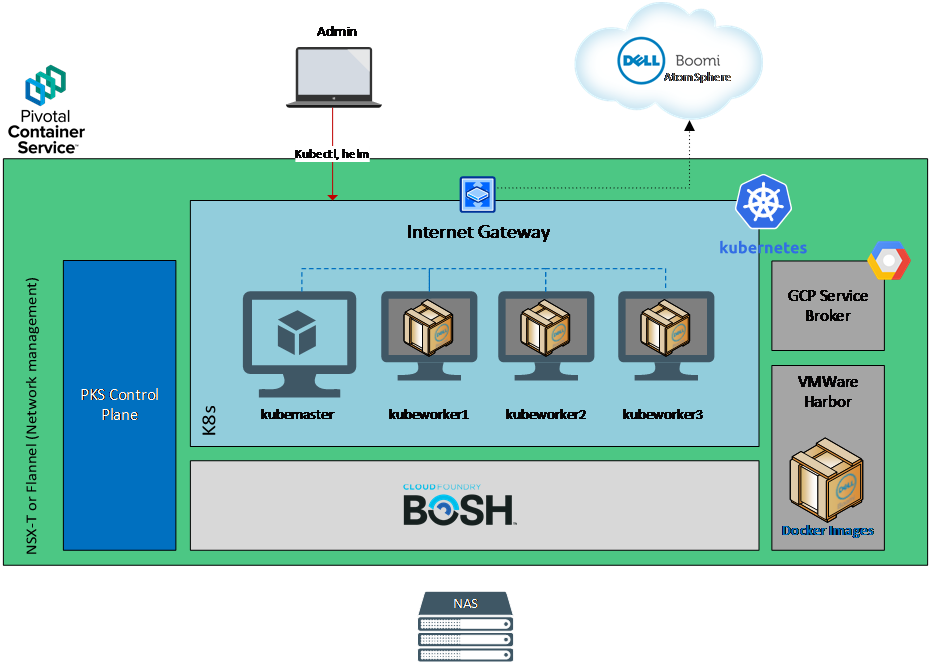
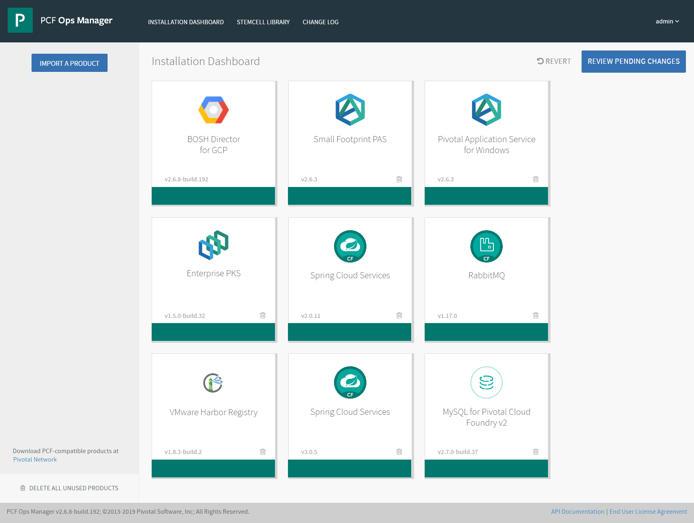
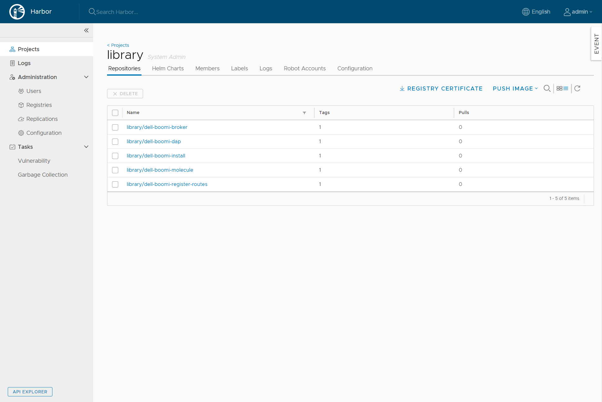
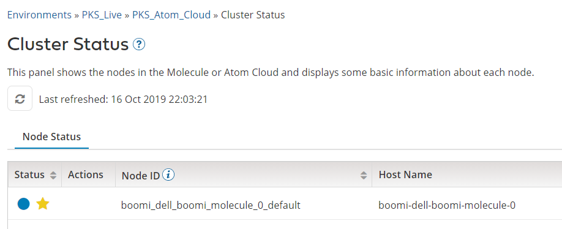
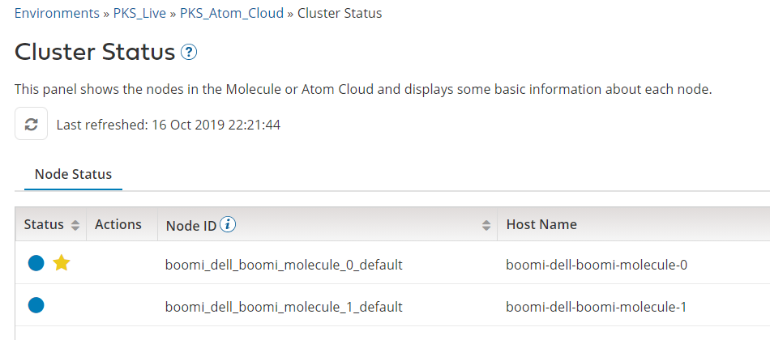

# Setup of a Dell Boomi Molecule with multiple nodes on Pivotal Container Service



## Prerequisites

1. Pivotal Platform with Enterprise PKS and VMWare Harbour
2. Outbound Internet access from PKS
3. A NAS / NFS Server (in or outside the Pivotal infrastructure)
4. Two AtomSphere accounts: one main account and one sub-account and that you have the Cloud Management enabled for both.  
   1. A Cloud created in the Main account and shared to the sub-account using  "Setup>Account Access>Account Groups"
   2. The environment doesn't need to be created before the installation

#Validation of the Pivotal Configuration

Connect to Pivotal Ops Manager and make sure that Enterprise PKS and VMWare Harbor registry are installed.



# Deployment of Boomi Molecule on PKS

Validate that you are connected to the PKS instance

```
$ kubectl config current-context
```
Unzip the archive

```
$ tar -xzvf dell-boomi-pks-0.11.7.tgz 
$ cd dell-boomi-pks-0.11.7
```

Initialize the cluster

```
$ kubectl apply -f helm.yml
serviceaccount/tiller created
clusterrolebinding.rbac.authorization.k8s.io/tiller created

```
then

```
$ helm init --wait --service-account tiller --upgrade
Creating /home/ant/.helm
Creating /home/ant/.helm/repository
Creating /home/ant/.helm/repository/cache
Creating /home/ant/.helm/repository/local
Creating /home/ant/.helm/plugins
Creating /home/ant/.helm/starters
Creating /home/ant/.helm/cache/archive
Creating /home/ant/.helm/repository/repositories.yaml
Adding stable repo with URL: https://kubernetes-charts.storage.googleapis.com
Adding local repo with URL: http://127.0.0.1:8879/charts
$HELM_HOME has been configured at /home/ant/.helm.

Tiller (the Helm server-side component) has been installed into your Kubernetes Cluster.

Please note: by default, Tiller is deployed with an insecure 'allow unauthenticated users' policy.
To prevent this, run `helm init` with the --tiller-tls-verify flag.
For more information on securing your installation see: https://docs.helm.sh/using_helm/#securing-your-helm-installation

```

Login to VMWare Harbor registry:

```
$ sudo docker login -u "admin" harbor.yourdomain.com
Password:
Login Succeeded

```
Load the Boomi images to the registry

```
$ sudo ./loadup harbor.yourdomain.com/library
```

Check that the images are pushed to Harbor



Fill up the values.yml file and run the installation

```
$ helm install --name boomi -f values.yml ./dell-boomi
NAME:   boomi
LAST DEPLOYED: Fri Oct 11 11:10:13 2019
NAMESPACE: default
STATUS: DEPLOYED

RESOURCES:
==> v1/ConfigMap
NAME                        DATA  AGE
boomi-dell-boomi-automount  1     0s

==> v1/PersistentVolume
NAME                     CAPACITY  ACCESS MODES  RECLAIM POLICY  STATUS  CLAIM                               STORAGECLASS  REASON  AGE
boomi-dell-boomi-nfs-pv  2Gi       RWX           Retain          Bound   default/boomi-dell-boomi-nfs-claim  0s

==> v1/PersistentVolumeClaim
NAME                        STATUS   VOLUME                   CAPACITY  ACCESS MODES  STORAGECLASS  AGE
boomi-dell-boomi-nfs-claim  Pending  boomi-dell-boomi-nfs-pv  0         0s

==> v1/Pod(related)
NAME                                      READY  STATUS             RESTARTS  AGE
boomi-dell-boomi-broker-6dd7dbfff6-sjbw8  0/2    Pending            0         0s
boomi-dell-boomi-molecule-0               0/1    Pending            0         0s
boomi-dell-boomi-rr-6df4484c-jnl8d        0/2    ContainerCreating  0         0s

==> v1/Role
NAME              AGE
boomi-dell-boomi  0s

==> v1/RoleBinding
NAME              AGE
boomi-dell-boomi  0s

==> v1/Secret
NAME              TYPE    DATA  AGE
boomi-dell-boomi  Opaque  3     0s

==> v1/Service
NAME                      TYPE          CLUSTER-IP      EXTERNAL-IP  PORT(S)       AGE
boomi-dell-boomi-broker   LoadBalancer  10.100.200.196  <pending>    80:30080/TCP  0s
boomi-dell-boomi-gateway  LoadBalancer  10.100.200.151  <pending>    80:31517/TCP  0s

==> v1/ServiceAccount
NAME              SECRETS  AGE
boomi-dell-boomi  1        0s

==> v1beta2/Deployment
NAME                     READY  UP-TO-DATE  AVAILABLE  AGE
boomi-dell-boomi-broker  0/1    1           0          0s
boomi-dell-boomi-rr      0/1    1           0          0s

==> v1beta2/StatefulSet
NAME                       READY  AGE
boomi-dell-boomi-molecule  0/1    0s


NOTES:
Congratulations!  You know have a 1-node cluster,
running in the AtomSphere PKS Atom Cloud/PKS - Live environment.

```

After about 30 minutes, you can check the status of the Molecule




# Scaling of Boomi Molecule on PKS


Update the values.yml file and execute a helm upgrade

For instance
Update values.yml from **nodes:  1** to **nodes:  2**
then:

```
$ helm upgrade -f values.yml boomi ./dell-boomi

(...)

NOTES:
Congratulations!  You know have a 2-node cluster,
running in the AtomSphere PKS Atom Cloud/PKS - Live environment.
```

After about 10 minutes, you can check the status of the Molecule

